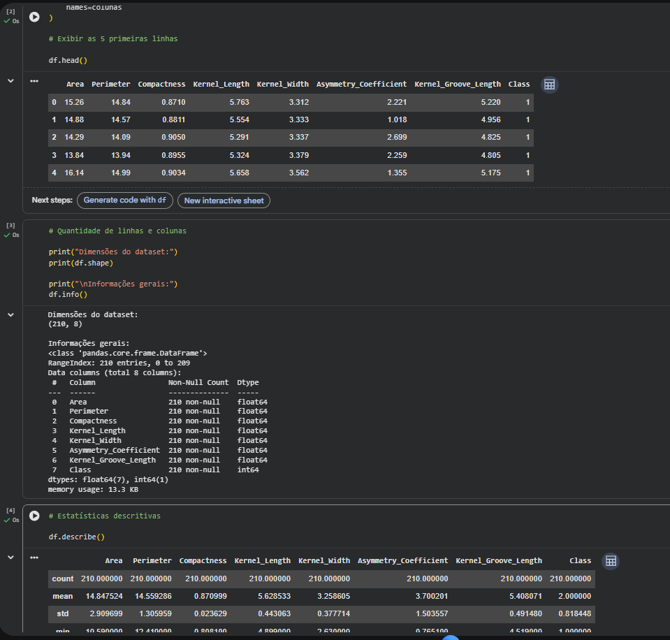
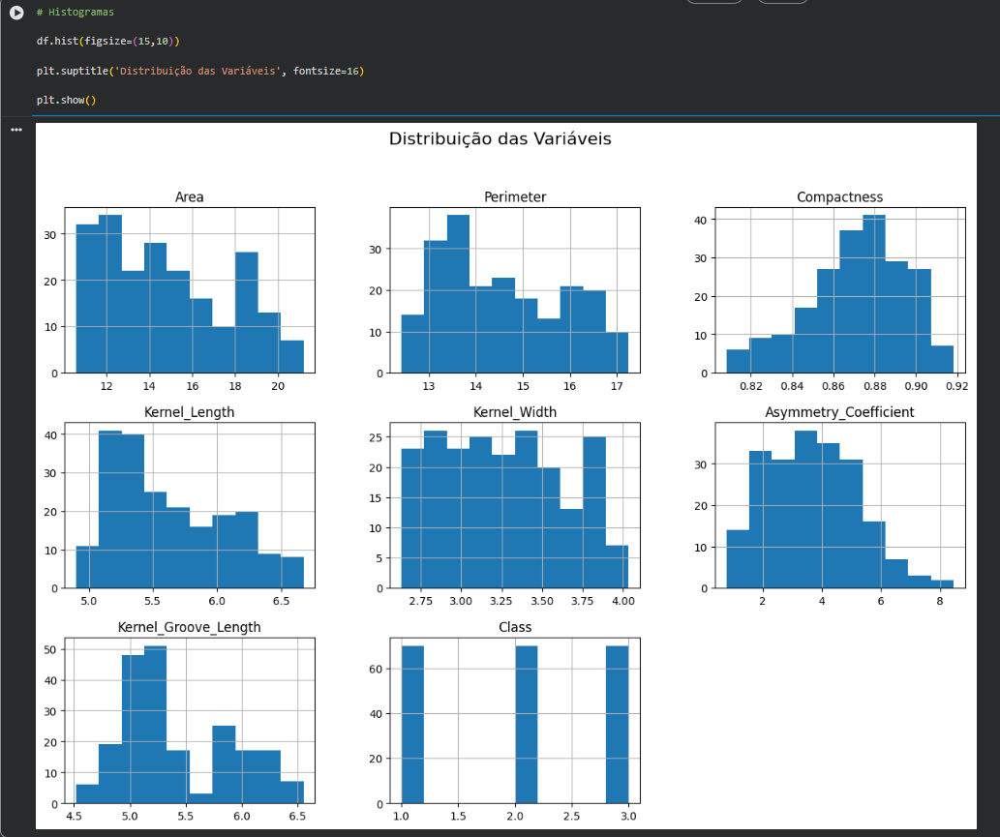
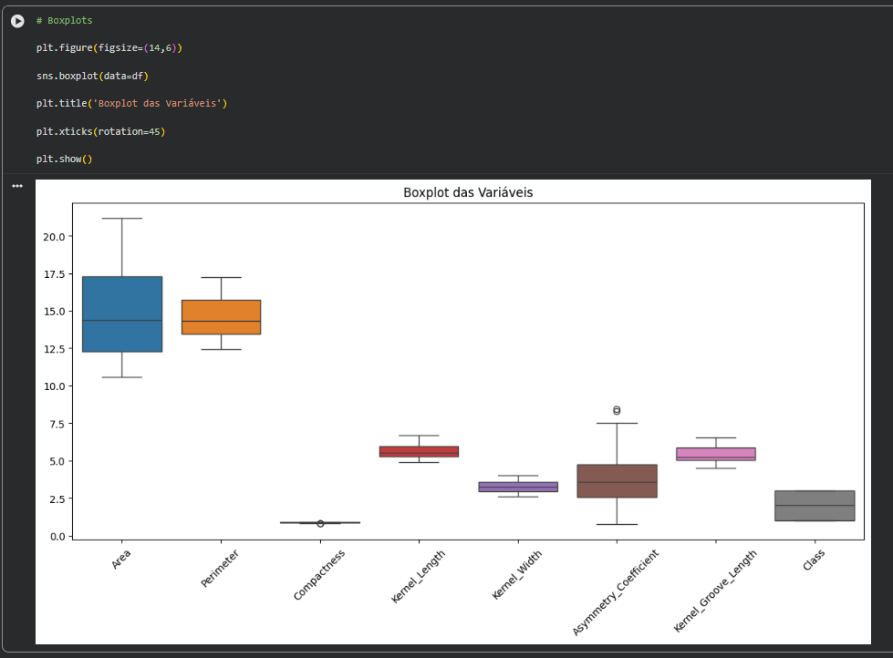
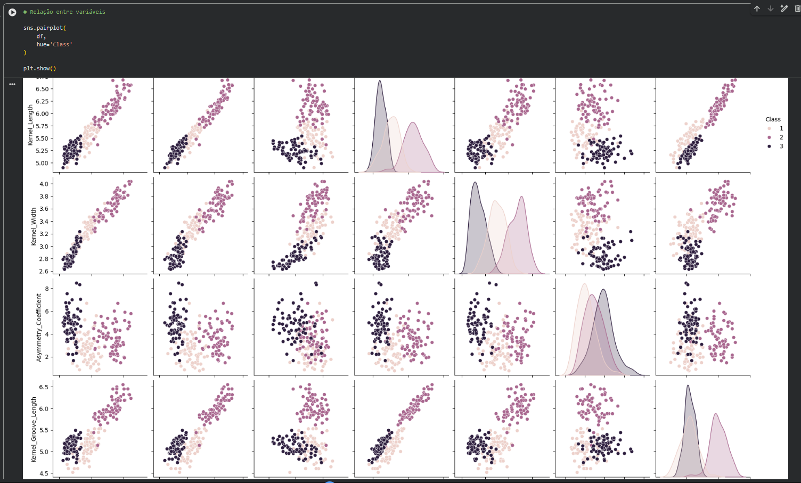
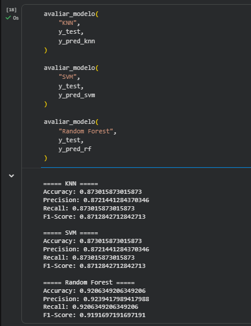
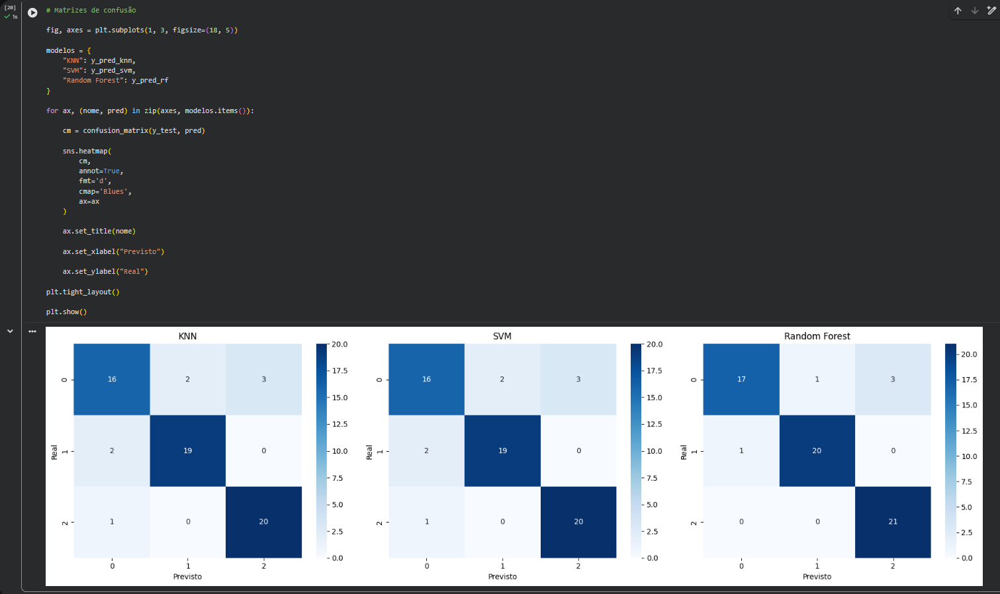
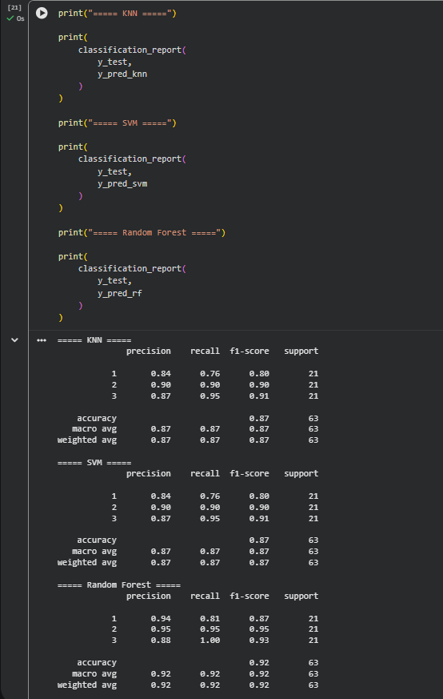
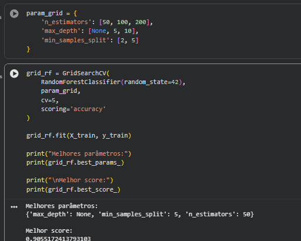

# FIAP - Faculdade de Informática e Administração Paulista

# FASE 04 - CTWP - Capítulo 3

## Implementando Algoritmos de Machine Learning com Scikit-learn


### 👩‍💻 Integrantes

* Natalia Faro - RM 568610

---

## 📜 Descrição

Este projeto tem como objetivo aplicar técnicas de Machine Learning para classificação automática de variedades de grãos de trigo utilizando o Seeds Dataset do UCI Machine Learning Repository.

A atividade foi desenvolvida seguindo a metodologia CRISP-DM, contemplando as etapas de entendimento do problema, análise exploratória dos dados, preparação dos dados, treinamento de modelos, avaliação de desempenho e otimização dos algoritmos.

Foram avaliados os algoritmos K-Nearest Neighbors (KNN), Support Vector Machine (SVM) e Random Forest, utilizando métricas como Accuracy, Precision, Recall, F1-Score e Matriz de Confusão.

O melhor resultado foi obtido pelo modelo Random Forest, alcançando aproximadamente 92% de acurácia.

---

## 📁 Estrutura de Pastas

```text
FASE_04_CTWP_Cap3
│
├── dataset
│   └── seeds_dataset.txt
│
├── notebook
│   └── Cap3_Seeds_Classification.ipynb
│
├── prints
│   ├── 01_dataset.png
│   ├── 02_histogramas.png
│   ├── 03_boxplots.png
│   ├── 04_scatterplots.png
│   ├── 05_metricas_modelos.png
│   ├── 06_matriz_confusao.png
│   ├── 07_classification_report.png
│   └── 08_random_forest.png
│
└── README.md
```

---

## 🔧 Como executar o código

1. Acesse o notebook localizado na pasta `notebook`.
2. Abra o arquivo `Cap3_Seeds_Classification.ipynb` utilizando Google Colab ou Jupyter Notebook.
3. Faça o upload do arquivo `seeds_dataset.txt`.
4. Execute todas as células do notebook em sequência.
5. Analise os gráficos, métricas e resultados gerados.

### Bibliotecas utilizadas

* Pandas
* NumPy
* Matplotlib
* Seaborn
* Scikit-learn

---

## 📊 Resultados

| Modelo        | Accuracy |
| ------------- | -------- |
| KNN           | 87,30%   |
| SVM           | 87,30%   |
| Random Forest | 92,06%   |

O algoritmo Random Forest apresentou o melhor desempenho entre os modelos avaliados.

---

## 📸 Evidências da Execução

### Dataset e Estatísticas



### Histogramas



### Boxplots



### Scatterplots



### Comparação dos Modelos



### Matrizes de Confusão



### Classification Report



### Otimização com GridSearchCV



---

## 🚀 Otimização

Foi utilizada a técnica GridSearchCV para otimização do modelo Random Forest.

Melhores parâmetros encontrados:

```python
{
 'max_depth': None,
 'min_samples_split': 5,
 'n_estimators': 50
}
```

Melhor score obtido:

```text
0.9055
```

---

## 📅 Histórico de Lançamentos

* 1.0.0 - Entrega da atividade FASE 04 - CTWP - Capítulo 3

---

## 📄 Licença

Projeto desenvolvido para fins acadêmicos na FIAP.
